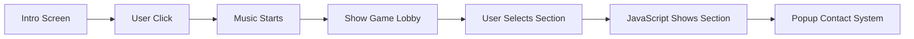

<h1 align="center">🎮 Amongus-Themed Portfolio</h1>

<p align="center">
  <b>Interactive Single Page Portfolio • Game UI • Fast • Responsive</b>
</p>

<p align="center">
  <a href="https://nirmalyaportfolio-chi.vercel.app/" target="_blank">
    
  </a>
</p>

---

## 🌟 Preview

<p align="center">
  
</p>

<p align="center">
  <i>Game lobby style navigation • Animated background • Popup contact</i>
</p>

---

## 🧠 Concept

<p align="center">
This portfolio is designed like a <b>game lobby</b> instead of a traditional resume.
</p>

<div align="center">

| Portfolio | Game |
|-----------|------|
Skills | Tasks 🎯  
Projects | Missions 🚀  
Contact | Emergency Meeting 🚨  

</div>

Users navigate without page reload → **Single Page Application (SPA)**.

---

## ✨ Features

<div align="center">

🎮 Game-style navigation  
🌌 Animated starfield background  
👾 Floating character Easter eggs  
🔊 Hover sound using Web Audio API  
🎵 Background music with fade-in  
🪟 Popup contact system  
⚡ Fast loading (no frameworks)  
📱 Fully responsive  

</div>

---

## 🛠️ Tech Stack

<p align="center">


</p>

---

## 🧩 How It Works



---

## 🖼️ Screenshots

<p align="center">
  
  
</p>

<p align="center">
  
  
</p>

---

## ⚡ Performance

<div align="center">

🚀 Single page → No reload  
🎨 CSS animations instead of heavy JS  
📦 Minimal assets  
🧠 No external libraries  

</div>

Loads in **under 1 second**.

---

## 🔊 Audio System

- Background music with fade-in  
- Hover beep generated using **Web Audio API**  
- Audio starts only after user interaction  

---

## 📱 Responsive Design

Works on:

<p align="center">
💻 Desktop &nbsp;&nbsp; 📱 Mobile &nbsp;&nbsp; 📟 Tablet
</p>

Centered layout + flexible units + media queries.

---

## 📂 Project Structure

```bash
portfolio/
│── index.html
│── style.css
│── script.js
│── assets/
│   ├── gifs/
│   ├── images/
│   └── audio/
│── README.md
```

---

## 🔮 Future Improvements

- 🎮 Keyboard navigation (game controls)  
- ⚛️ React version  
- 🗄️ Backend for dynamic projects  
- ♿ Accessibility improvements  

---

## 👨‍💻 Author

<p align="center">
<b>Nirmalya Kumar Mohanty</b><br/>
CSE Student • Web Developer • Java Backend Learner
</p>

---

## ⭐ Support

<p align="center">
⭐ Star the repo &nbsp;&nbsp; 🍴 Fork it &nbsp;&nbsp; 🎮 Build your own game portfolio
</p>

---

## 📄 License

Free for personal and educational use.
